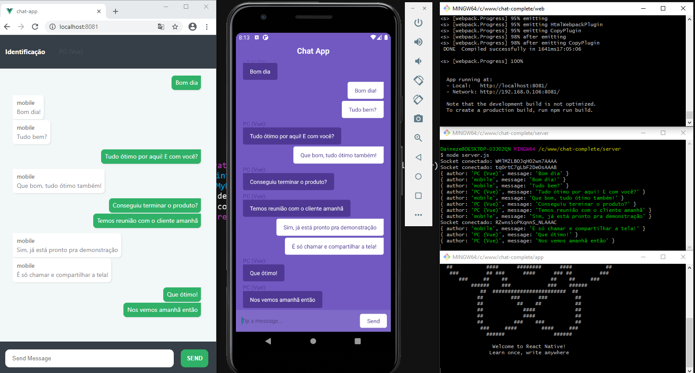

   

# Complete Chat Solution
Uma solução de chat de 3 pontas, que utiliza
- Server NodeJS;
- Web VueJS;
- App ReactJS.

A Solução apresentada é simples, não conta com login ou usuário, serve apenas para demonstrar a utilização de socket.io para comunicação entre duas plataformas utilizando node como back-end.
